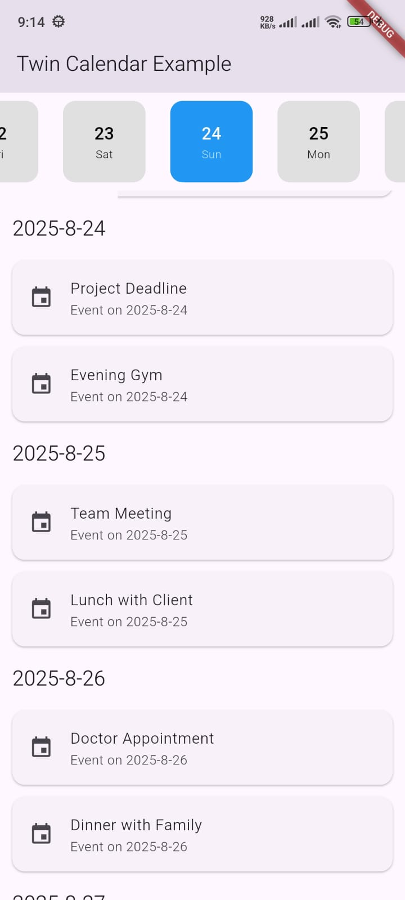
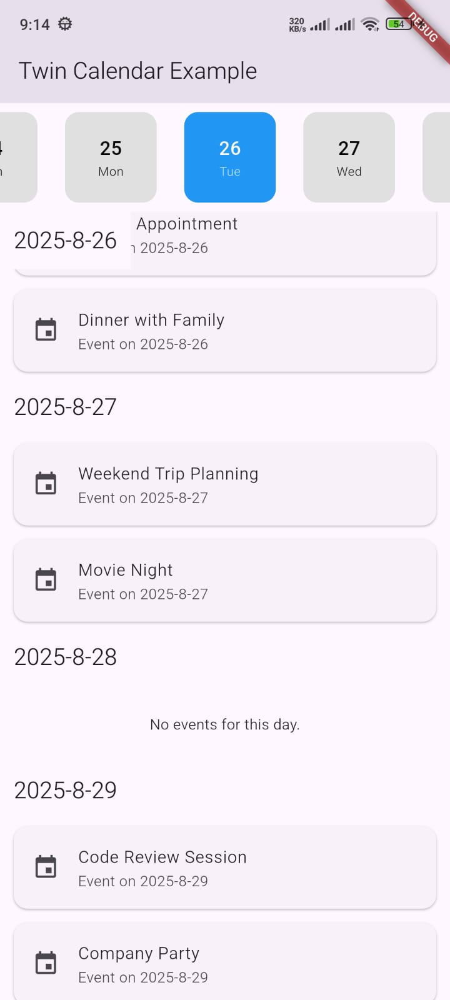
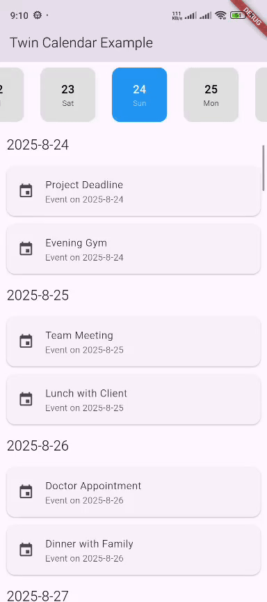

# Twin Axis Calendar

A customizable twin calendar widget for Flutter that displays a **horizontal date selector** synced
with a **vertical, scrollable list of events**.







---

## ✨ Features

- **Synced Scrolling**: Horizontal date list and vertical event list stay in sync.
- **Highly Customizable**: Use builder functions to create your own UI for dates, events, headers,
  and empty states.
- **Date Range Control**: Configure how many days to show in the past and future.
- **Smooth Animations**: Built-in animations for scrolling to dates.

---

## 🚀 Getting Started

### Installation

Add this to your package's `pubspec.yaml`:

```yaml
dependencies:
  twin_axis_calendar: ^0.0.1 # Replace with the latest version
```

Then, install it by running:
```yaml
flutter pub get
```

## Import it
Now in your Dart code, you can use:
```dart
import 'package:twin_axis_calendar/twin_axis_calendar.dart';
```

Basic Usage
```dart


class MyCalendarPage extends StatelessWidget {
  const MyCalendarPage({super.key});

  @override
  Widget build(BuildContext context) {
    DateTime dateOnly(DateTime date) => DateTime(date.year, date.month, date.day);

    // Dummy event data (all normalized)
    final Map<DateTime, List<String>> _events = {
      dateOnly(DateTime.now()): ['Project Deadline', 'Evening Gym'],
      dateOnly(DateTime.now().add(const Duration(days: 1))): ['Team Meeting', 'Lunch with Client'],
      dateOnly(DateTime.now().add(const Duration(days: 2))): [
        'Doctor Appointment',
        'Dinner with Family'
      ],
      dateOnly(DateTime.now().subtract(const Duration(days: 1))): [
        'Grocery Shopping',
        'Call with Manager'
      ],
      dateOnly(DateTime.now().add(const Duration(days: 3))): [
        'Weekend Trip Planning',
        'Movie Night'
      ],
      dateOnly(DateTime.now().add(const Duration(days: 5))): [
        'Code Review Session',
        'Company Party'
      ],
    };

    return Scaffold(
      appBar: AppBar(title: const Text('Twin Calendar Example')),
      body: TwinCalendarMain<String>(
        selectedDate: DateTime.now(),
        items: (date) {
          // Normalize date (remove time part)
          final dateOnly = DateTime(date.year, date.month, date.day);
          return _events[dateOnly] ?? [];
        },
        horizontalCalendarItemBuilder: (context, date, isSelected) {
          return Container(
            width: 80,
            margin: const EdgeInsets.all(8),
            decoration: BoxDecoration(
              color: isSelected ? Colors.blue : Colors.grey.shade300,
              borderRadius: BorderRadius.circular(12),
            ),
            child: Column(
              mainAxisAlignment: MainAxisAlignment.center,
              children: [
                Text(
                  '${date.day}',
                  style: TextStyle(
                    color: isSelected ? Colors.white : Colors.black,
                    fontWeight: FontWeight.bold,
                    fontSize: 18,
                  ),
                ),
                Text(
                  // Use intl for real apps → DateFormat('E').format(date)
                  ['Mon', 'Tue', 'Wed', 'Thu', 'Fri', 'Sat', 'Sun'][date.weekday - 1],
                  style: TextStyle(
                    color: isSelected ? Colors.white70 : Colors.black87,
                    fontSize: 12,
                  ),
                ),
              ],
            ),
          );
        },
        stickyHeaderBuilder: (date) {
          return Container(
            color: Theme.of(context).scaffoldBackgroundColor,
            padding: const EdgeInsets.all(12),
            child: Text(
              // You can format with intl → DateFormat('yMMMMd').format(date)
              '${date.year}-${date.month}-${date.day}',
              style: Theme.of(context).textTheme.titleLarge,
            ),
          );
        },
        onEventBuilder: (date, event) {
          return Card(
            margin: const EdgeInsets.symmetric(horizontal: 12, vertical: 6),
            child: ListTile(
              leading: const Icon(Icons.event),
              title: Text(event),
              subtitle: Text('Event on ${date.year}-${date.month}-${date.day}'),
            ),
          );
        },
        onEmptyBuilder: () {
          return const Center(
            child: Padding(
              padding: EdgeInsets.all(24.0),
              child: Text('No events for this day.'),
            ),
          );
        },
      ),
    );
  }
}

```

🎨 Customization

You can customize the calendar’s behavior and appearance with these properties:

| Property                        | Description                                                                      |
| ------------------------------- | -------------------------------------------------------------------------------- |
| `selectedDate`                  | The initially selected date.                                                     |
| `items`                         | Function that provides the list of events for a given date.                      |
| `horizontalCalendarItemBuilder` | Builder for the horizontal date items.                                           |
| `onEventBuilder`                | Builder for each event widget in the vertical list.                              |
| `stickyHeaderBuilder`           | Builder for sticky date headers in the vertical list.                            |
| `onEmptyBuilder`                | Builder for the widget shown when a day has no events.                           |
| `daysInPast`                    | Number of days to display before the initial date (default: 365).                |
| `daysInFuture`                  | Number of days to display after the initial date (default: 365).                 |
| `scrollDuration`                | Animation duration when scrolling between dates.                                 |
| `scrollCurve`                   | Animation curve for scrolling.                                                   |
| `horizontalScrollAlignment`     | Alignment of the selected item in the horizontal list (0.0 = left, 1.0 = right). |


🤝 Contributing

Contributions are welcome!
Please open an issue or submit a pull request if you’d like to improve the package.
